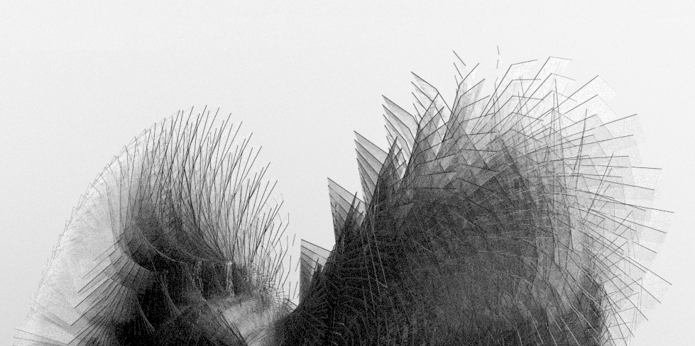
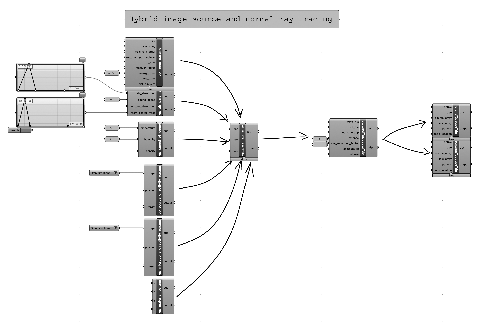

# Duerer



Audio synthesis and virtual acoustics for [Rhino](https://www.rhino3d.com) [Grasshooper](https://www.rhino3d.com/6/new/grasshopper/) based on image source model room simulation.\
For future more information see [here](https://www.opasquet.fr/spatial-computing-composition/).\
This release consists on python code runing underneath a collection of [Grasshooper](https://www.rhino3d.com/6/new/grasshopper/) components.

This is an early experimental version.

*Duerer* is part of a research done at the [Institute for Computer Music and Sound Technology](https://www.zhdk.ch/en/research/icst) of the [Zurich University of the Arts](https://www.zhdk.ch).

The first use would consist on:
- generating, or importing, a tree of meshes.
- setting meshes acoustic properties and rendering parameters (those do not have to be realistic and outcomes can be used as a virtual acoustic or synthesis tool).
- place virtual sources and microphones into those meshes.
- (define directivities for sources and microphones).
- define sound sources.
- rendering as a multichannel [impulse response](https://en.wikipedia.org/wiki/Impulse_response) file (each channel is a microphone) and possibly a convolved file made with sound sources.

One possible use would consist on rendering multichannel impulse responses from a beam of microphones or a virtual eigenmike; thus playing with directivity, delays and virtual [ambisonics](https://en.wikipedia.org/wiki/Ambisonics).\
Another use would be using specific meshes to generate physical models audio synthesis from finite elements method.\
It can for instance be used for form finding using genetic algorithm solvers like [galapagos](http://climatefacade.com/genetic-algorithm-solver-galapagos/) for instance. That is a part of that research at ICST.


## Technologies Used
- [Rhino](https://www.rhino3d.com)
- [Grasshooper](https://www.rhino3d.com/6/new/grasshopper/)
- [Pyroomacoustics](https://pyroomacoustics.readthedocs.io)


## Screenshots
Available Grasshooper components:\


Components dealing with spectral absorption for each mesh face:
<center></center>


## Project Status
Project is: _in progress_
<!--/ _complete_ / _no longer being worked on_. If you are no longer working on it, provide reasons why.-->


## Dependencies
  ```shell
rhino3d
pyroomacoustics
numpy
scipy>=0.18.0
cython
pybind11
  ```

## Acknowledgements
- Many thanks to Jasch, Toro-Pérez Germán for their support and Robin Scheibler for his tremendous work on Pyroomacoustics. I would have never done that work without the support of the [Zurich University of the Arts Zurich University of the Arts](https://www.zhdk.ch).


## Contact
Created by [Olivier Pasquet](https://www.opasquet.fr).
